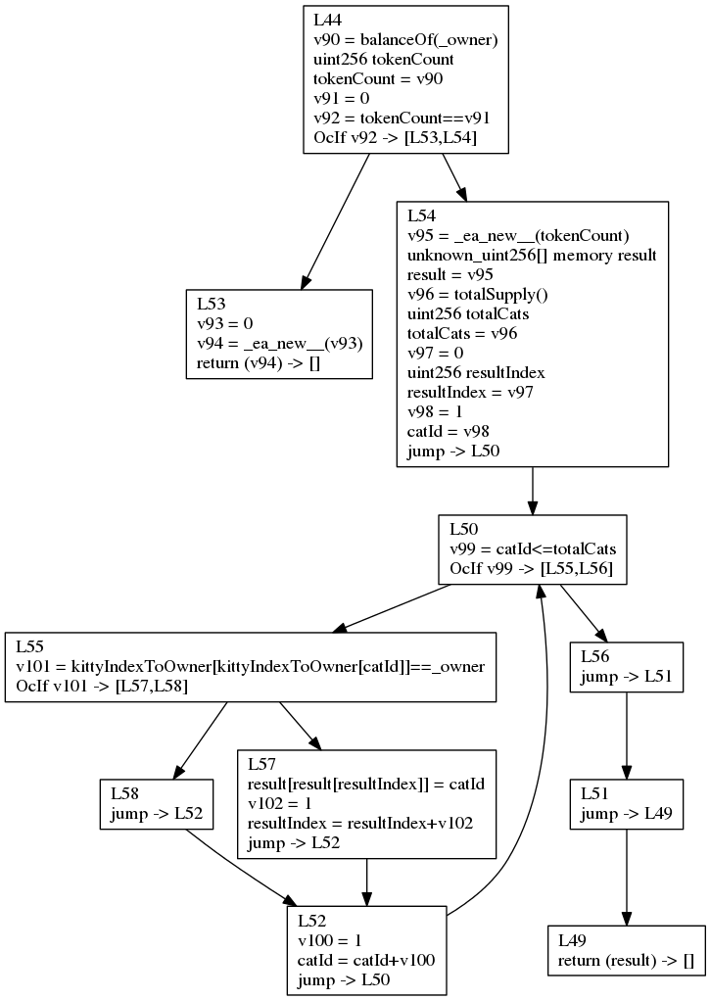
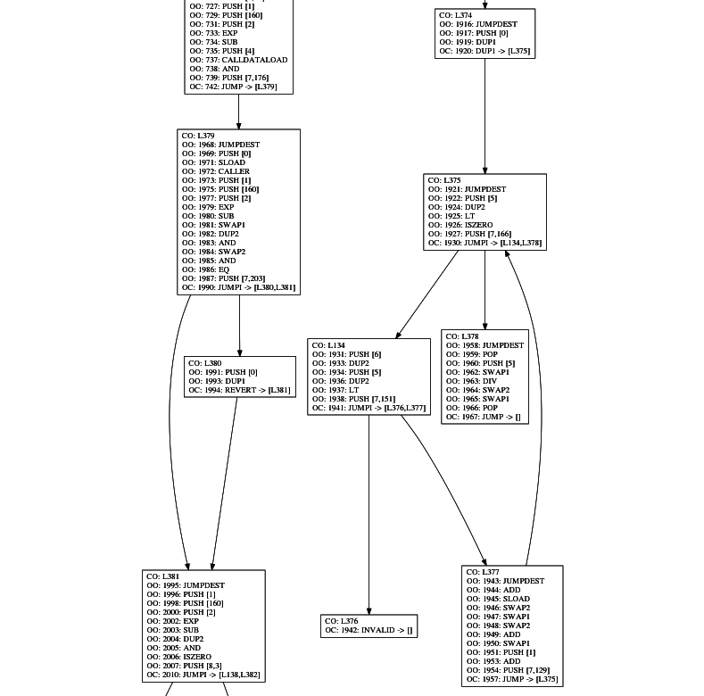

# ethereum-analyzer [](https://hackage.haskell.org/package/ethereum-analyzer) [](https://travis-ci.org/zchn/ethereum-analyzer)

- [Usage](#usage)
  - [Solidity Control Flow Graph (CFG) Generation](#solidity-control-flow-graph-cfg-generation)
  - [Solidity Linter (WIP)](#solidity-linter-wip)
  - [EVM CFG Generation](#evm-cfg-generation)

## Usage

### Solidity Control Flow Graph (CFG) Generation

```shell
stack build --profile &&\
  solc --combined-json ast examples/etherscan.io/CryptoKittiesCore.sol |\
  stack exec -- ea-analyze &&\
  find work/ -name "*.dot" -exec dot -Tpng -O \{\} \;
```

generates CFGs like



whose original code looks like

```javascript
function tokensOfOwner(address _owner) external view returns(uint256[] ownerTokens) {
  uint256 tokenCount = balanceOf(_owner);
  if (tokenCount == 0) {
    return new uint256[](0);
  } else {
    uint256[] memory result = new uint256[](tokenCount);
    uint256 totalCats = totalSupply();
    uint256 resultIndex = 0;
    uint256 catId;
    for (catId = 1; catId <= totalCats; catId++) {
      if (kittyIndexToOwner[catId] == _owner) {
        result[resultIndex] = catId;
        resultIndex++;
      }
    }
    return result;
  }
}
```

### Solidity Linter (WIP)

``` shell
stack build
solc --combined-json ast\
  examples/analysis-benchmark/selfdestruct-over-suicide.sol |\
  stack exec ea-analyze
```

### EVM CFG Generation

``` shell
stack build
cat examples/etherscan.io/CryptoKittiesSalesAuction.evm | stack exec -- ea-bytecode-vis --outDot=work/tmp.dot &&\
  dot -Tpng work/tmp.dot -O
```

generates a pretty large CFG for the whole EVM bytecode sequence, part of which
looks like


